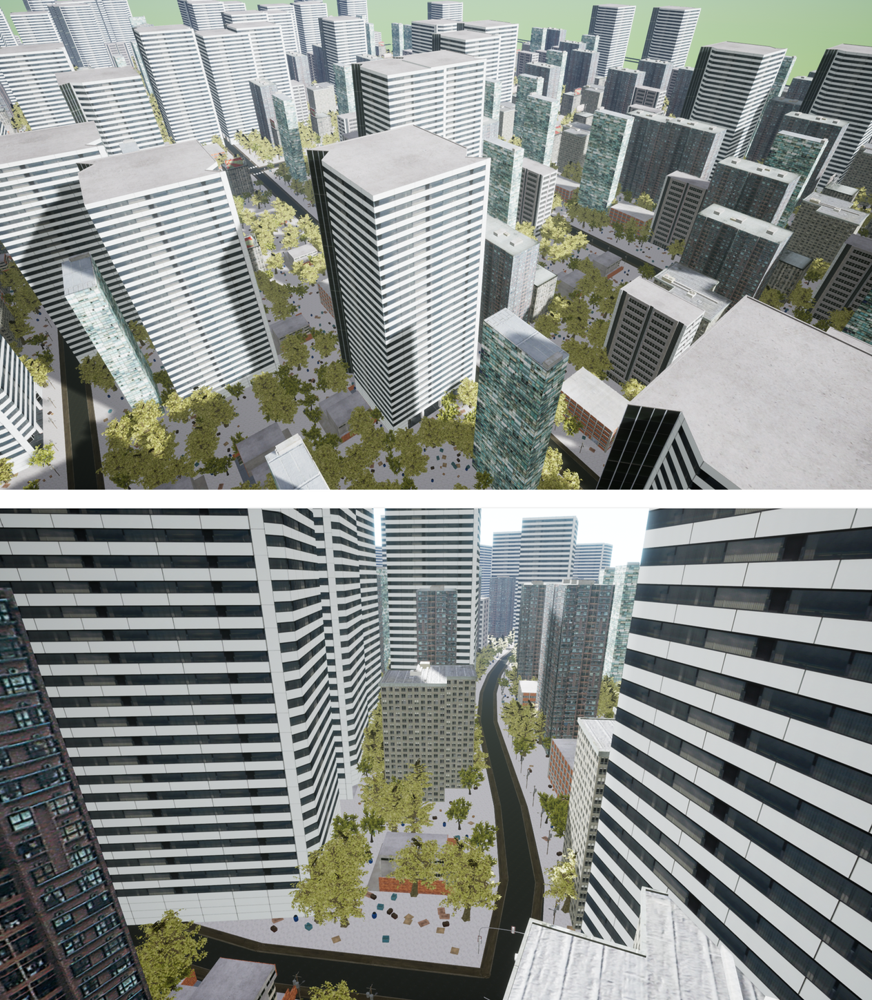
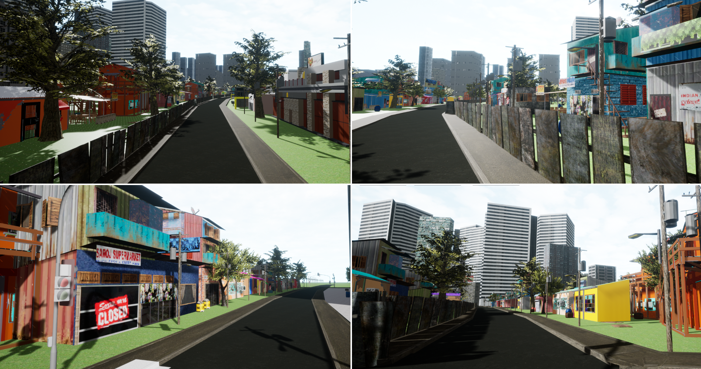
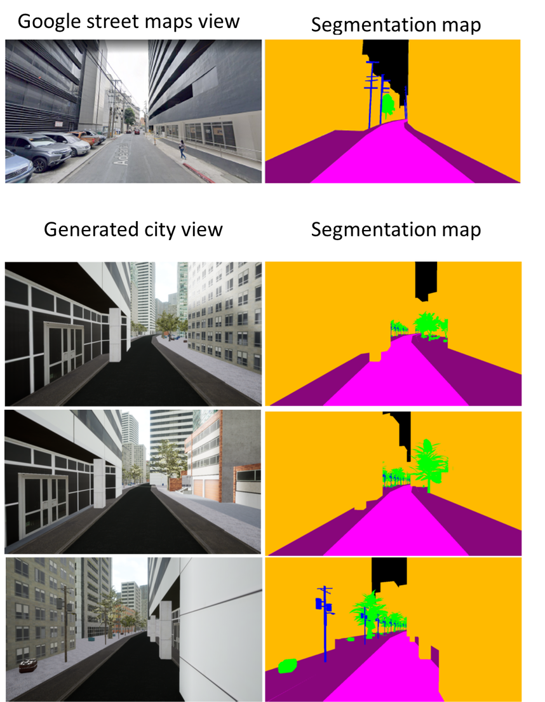
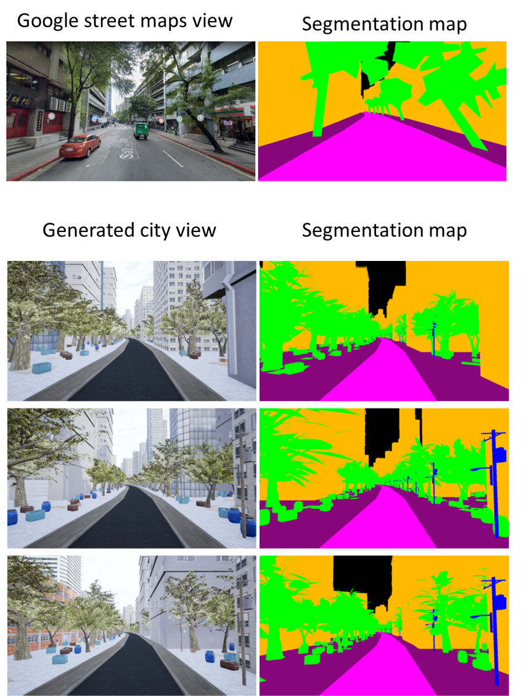

# 
 Procedurally Generating Virtual Philippine Cities from Road Network Data
### 
To appear in Philippine Computing Journal 

### 
Neil Patrick Del Gallego, Jacob Manzano, Bruce Anakin Miranda, Jan Carlo San Juan, Jaso Jacob Santiago 

### 
De La Salle University - Graphics, Animation, Multimedia, and Entertainment (GAME) Lab

 

### <strong>Paper (to appear in the Philippine Computing Journal - 2022) | <a href = "https://kiwigamedev.github.io/Procedural-City-Generator/">Website for source code </a> </strong>
<b>Note:</b> The paper that will be posted was peer-reviewed and has undergone revisions. It is more updated than the contents in the source code website. To request a proof copy, please email the corresponding author: neil.delgallego@dlsu.edu.ph

### Abstract

 Researchers and urban planners utilized procedural city generation (PCG) systems to simulate virtual cities. To some extent, virtual cities generated also serve as a testbed for other simulations, such as crowd simulation and transport planning. In this study, we are the first to present a set of PCG techniques for generating Philippine cities. Our literature review shows that most PCG systems reference American or European cities in context. Using these systems does not generate plausible Philippine cities consistent with real-world examples. Referencing Google street map data, we propose a new set of rules for generating virtual Philippine cities and designed a new PCG. We first developed an algorithm that assembles road layouts from OpenStreetMap data, where we implemented a filtering approach for handling missing road information and minimizing dead ends. Lots and zones are generated using a subdivision method and Perlin noise-inspired randomization, which maximizes the number of building entities spawned in a given lot space. Lastly, since we fully support free virtual camera movements in our environment, we designed an approach that additionally generates road and lot props, such as sidewalks, electric poles, fences, and trees. Thus, our generated virtual city has more visual elements that can also be viewed at a street level, providing a more immersive feel. We tested our PCG by quantitatively comparing virtual street views with Google street map views. Our extensive analysis shows we can reasonably generate Philippine cities with little to no fine-tuning. 

### Preview of generated cities
We showcase some procedurally generated cities using our proposed approach.

 
 

 
 

 
 
We provide semantic maps to visualize class labels between synthetic images and real-world images via Google map street view.

 
 

 
 

### Technical trailer

<iframe frameborder="0" allowfullscreen="1" allow="accelerometer; autoplay; clipboard-write; encrypted-media; gyroscope; picture-in-picture; web-share" title="Procedural Philippine City Generation using Real World Road Network Data" width="100%" height="100%" src="https://www.youtube.com/embed/691sJ57nHv8?autoplay=0&amp;mute=0&amp;controls=1&amp;origin=https%3A%2F%2Fkiwigamedev.github.io&amp;playsinline=1&amp;showinfo=0&amp;rel=0&amp;iv_load_policy=3&amp;modestbranding=1&amp;enablejsapi=1&amp;widgetid=1" id="widget2"></iframe>

### Citation
We will provide the bibtex citation once the official article has been released. It is currently in press.

### Acknowledgements
We would like to acknowledge De La Salle University (DLSU) for funding this research.